# KarigarKiDuniya
An online store portal that helps the sellers to determine the best price for their product and we also aim to increase the sales and hence profit our vendors by including customer specific details like "Saerch by Image" and "Frequently bought together".

  
  Login page (Username and Password)
  
  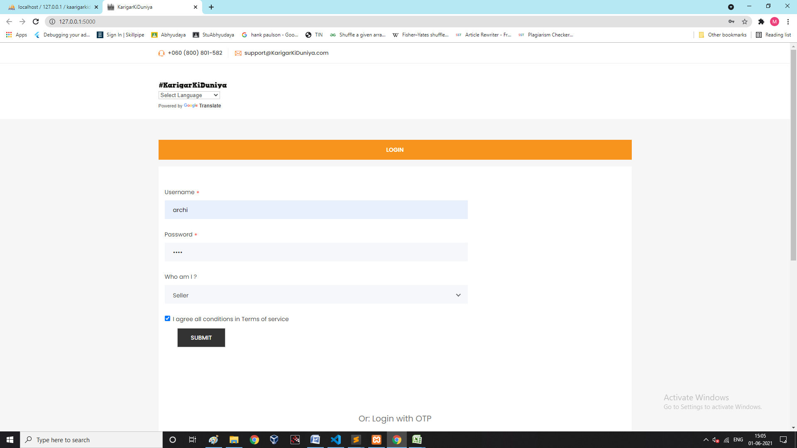
  
  
  Login page (OTP)
  
  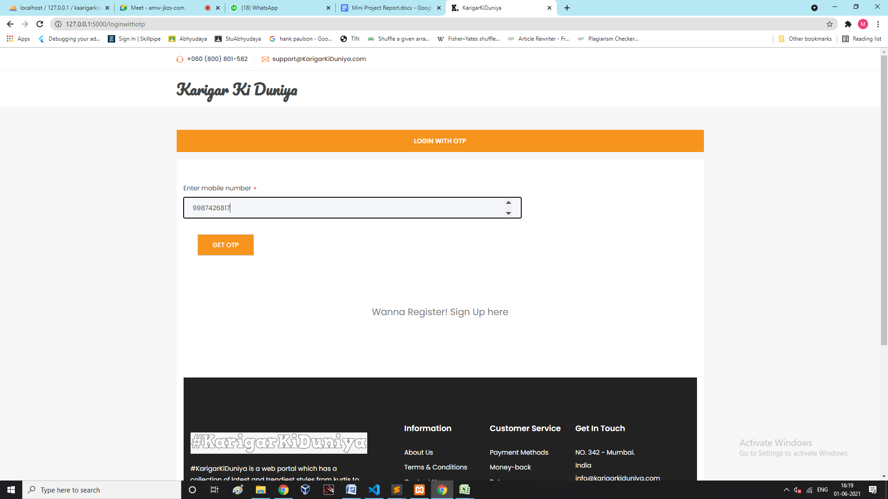
  
  
  Register
  
  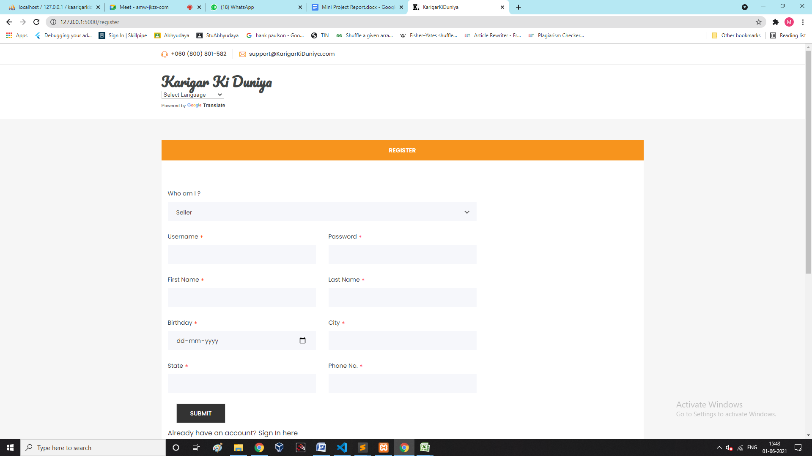
  
  
  Seller Dashboard
  
  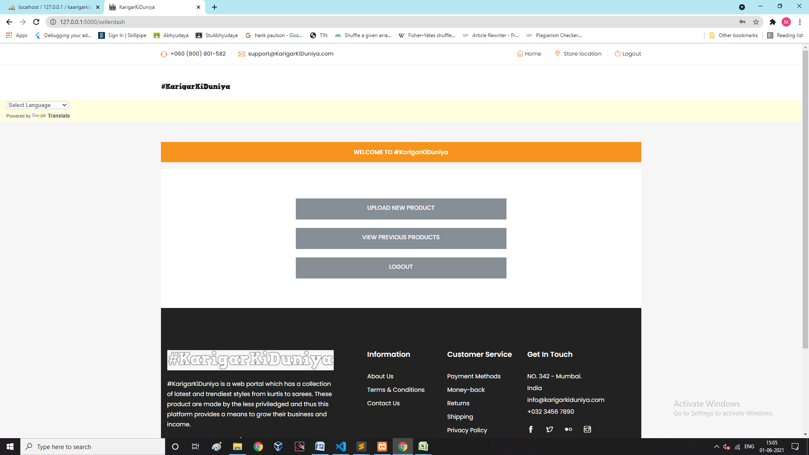
  
  
  Product Upload
  
  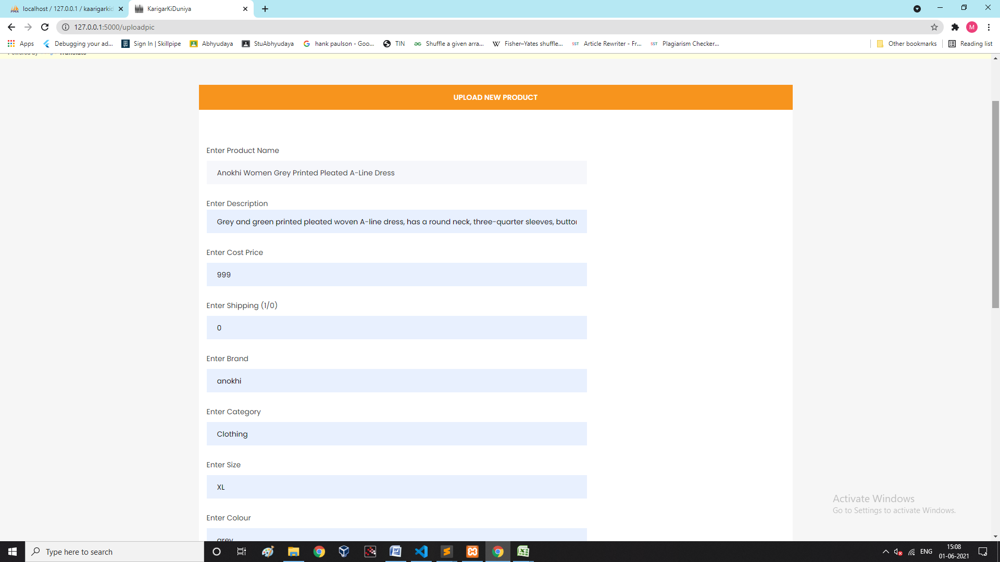
  
  
  Price Prediction
  
  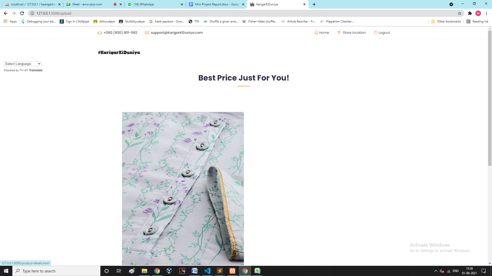
  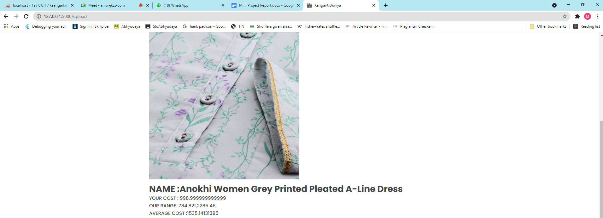
  
  Previously Uploaded Products
  
  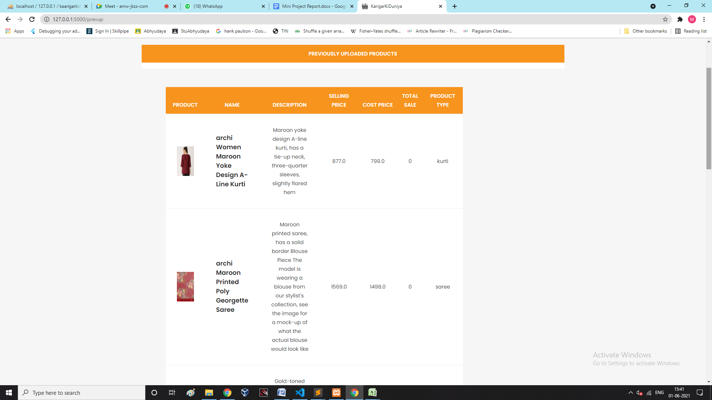
  
  Nearest Drop-off Center
  
  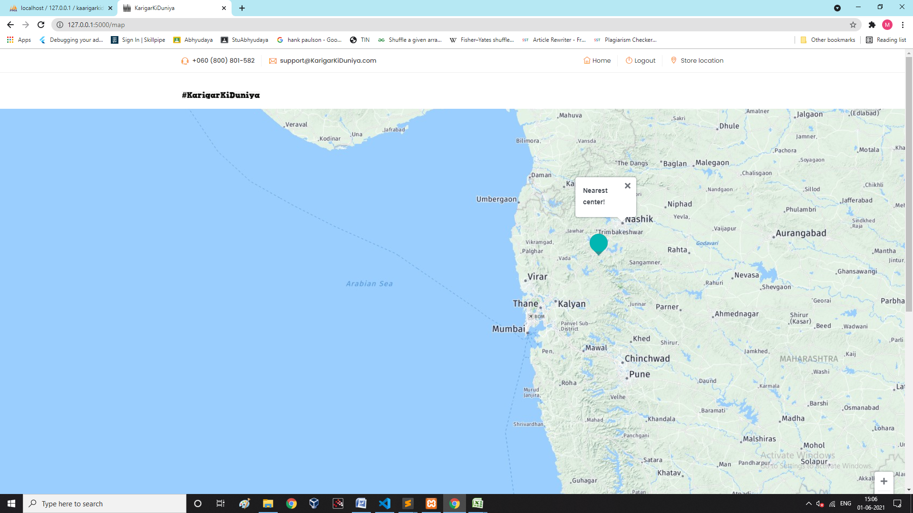
  
  Google Translate
  
  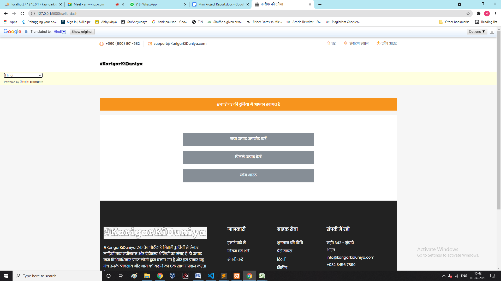
  
  Customer Dashboard
  
  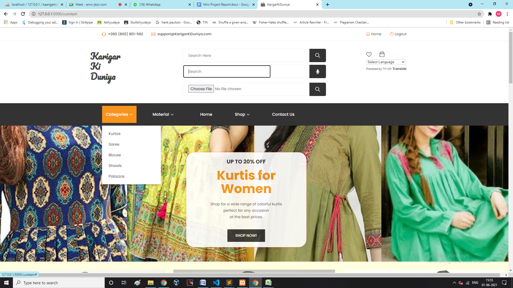
  
  Blouse Display Page
  
  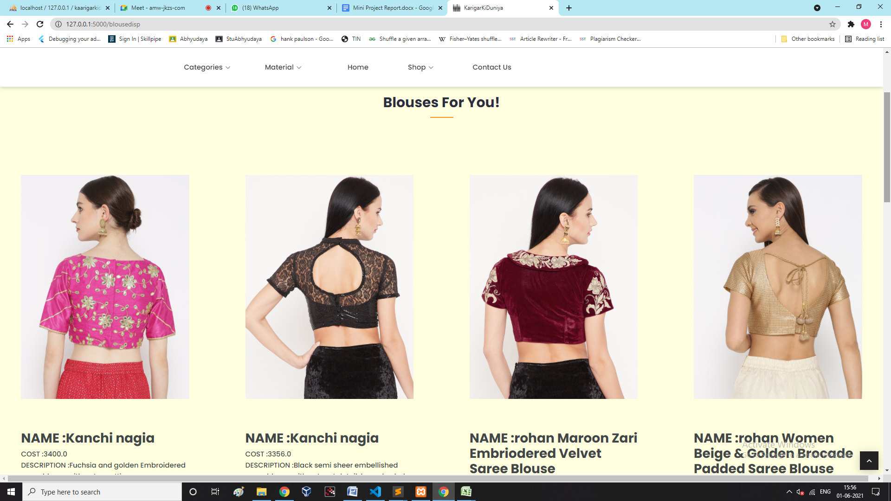
  
  Kurti Display Page
  
  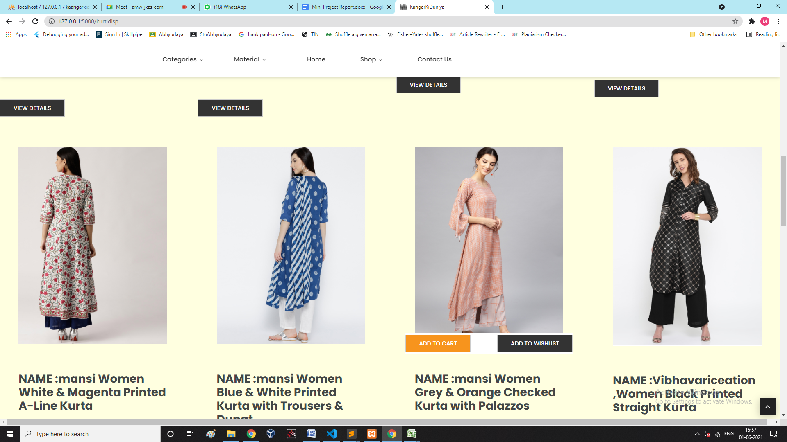
  
  Keyword Search
  
  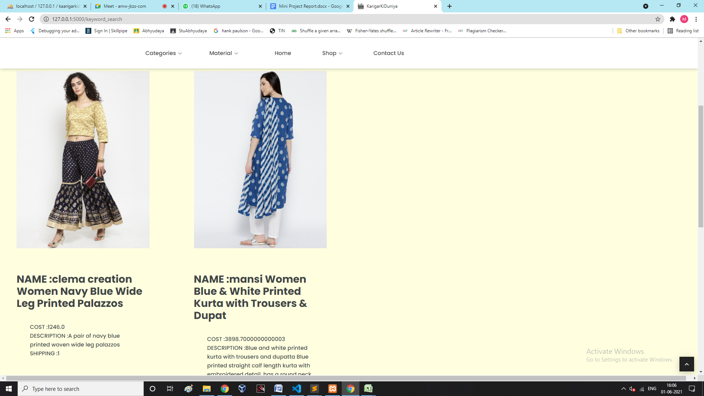
  
  Frequently Brought together
  
  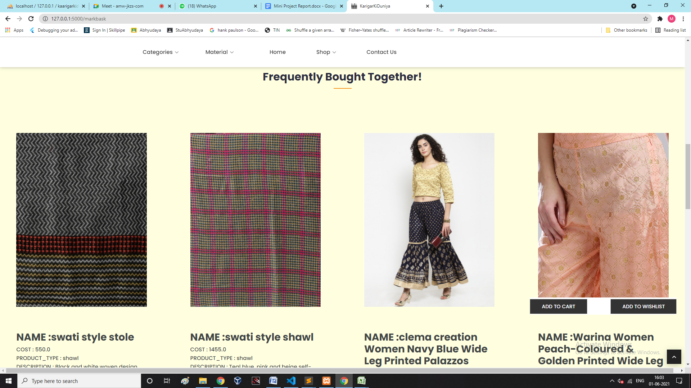
  
  Payment Gateway
  
  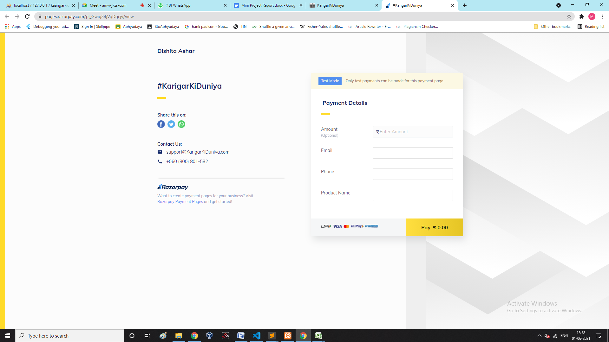

